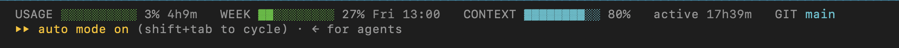

# Claude Utility System

A modular utility layer for the Claude Code terminal — a **status bar built from toggleable panels** plus a few **settings features**, all managed from one **visual in-terminal app**. The repo is the system; each panel and feature is a part you switch on or off.



The configurator — toggle panels and features, with a live preview:

```
 Claude Utility System   configure your terminal status bar

  > [x]  Plan usage     5h session + weekly (All Models) limits
    [x]  Context        context-window fill for this session
    [ ]  Cost           session cost estimate + elapsed time
    [ ]  Git            branch, staged/modified, open PR
    [ auto ] Layout     auto = one row, wraps when narrow
    [ ]  Notifications  desktop ping on done / needs-input (macOS)
    [ ]  Subagent rows  custom rows in the subagent panel
    [ ]  Auto-allow Bash stop prompting for read-only commands

 Preview
  USAGE ▓▓▓▓░░░░░░ 47% 2h13m   WEEK ▓▓░░░░░░░░ 24% Fri 13:00   CTX ▓▓▓░░░ 32% 64k/200k
```

## Parts of the system

**Status-bar panels** — compose into one responsive bar (one row, wraps to stacked rows when narrow). Panels are **billing-aware** and hide when not relevant to the current chat:
- **Plan usage** — 5h session + weekly (All-Models) limits, coloured bars + reset times, synced to one value across every terminal at near-zero CPU. *(subscription only)*
- **Context** — context-window fill: percentage + tokens used, counted as `total_input_tokens + total_output_tokens` so it matches Claude's own "tokens to save" counter.
- **Cost** — session cost in dollars. *(API / pay-per-use only — it's notional on a subscription)*
- **Active** — how long this session has been running.
- **Git** — branch, staged/modified counts, open PR + review state.

**Settings features** — synced into `settings.json` (your other settings preserved):
- **Notifications** — macOS desktop ping when a run finishes or needs input.
- **Subagent rows** — custom formatting for the subagent panel.
- **Auto-allow Bash** — a conservative read-only allowlist so routine commands stop prompting.

**Extra:** a `session-namer` alias to launch Claude with a folder-derived session name.

## Install

```sh
cp -R skills/utility-system ~/.claude/skills/
~/.claude/skills/utility-system/assets/install.sh
```

Then open the admin panel by typing **`! cus`** in the Claude prompt (the `!` runs it in your real terminal, then returns to Claude on exit). `/utility-system` is a slash command that reminds you of this. In the panel: arrow keys move, **space** toggles or cycles the layout, live preview, **s** save, **Esc**/**q** to return. Requires `jq`; macOS for the notifier.

A plain slash command can't take over the terminal (it only prompts Claude), so the interactive panel launches via the `!` bang-prefix.

## How it stays cheap

Opening more terminals doesn't multiply work. The account-wide usage panel uses a shared cache — one session computes the value, the rest just read it; a normal render spawns only `date`/`stat`, no `jq`. This avoids the fork/exec storm that pins macOS `sysmond` when a heavy status line refreshes every second in every window. Per-session panels read this session's JSON directly.

## Scope — system, not content

This is a **system** tool: how you operate Claude Code (status bar, settings, notifications, ergonomics). It deliberately contains **no** content generation, domain, or work-process logic. The test: *drop it into a stranger's Claude Code with none of your projects — does it still work?* Yes. That's the line.

## License

MIT. Free to copy, fork, and adapt.
